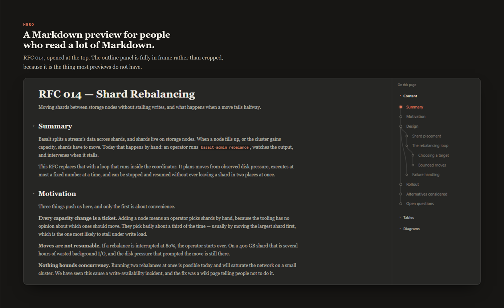
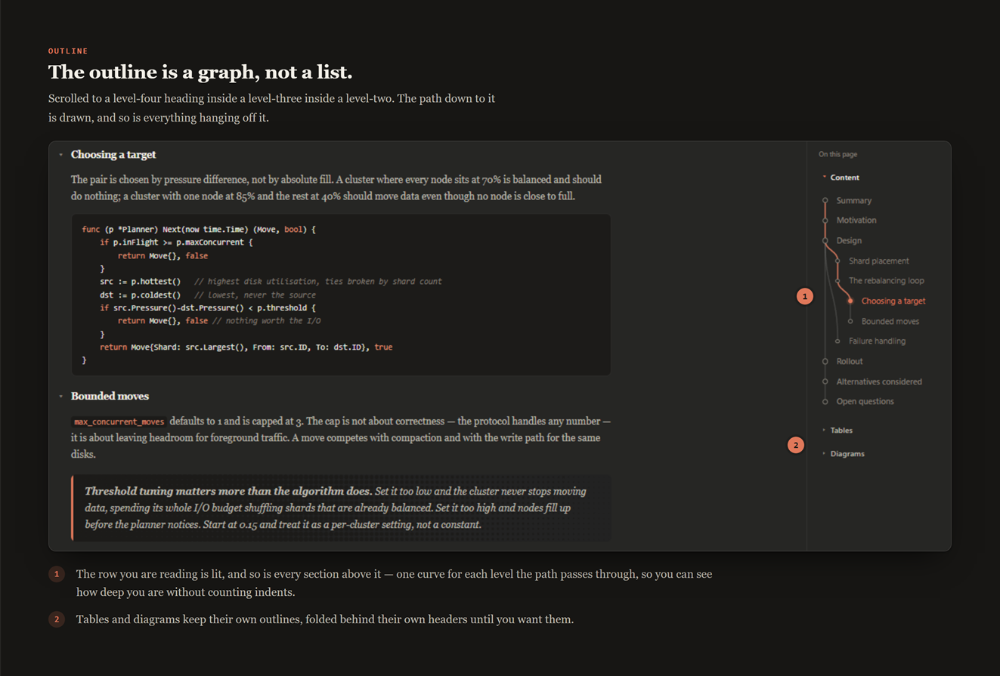
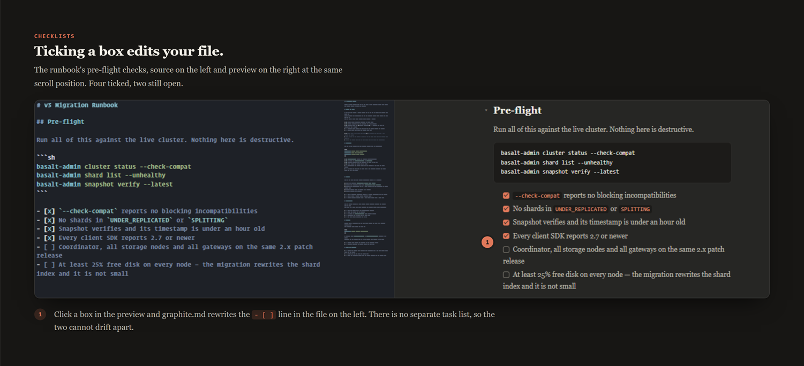
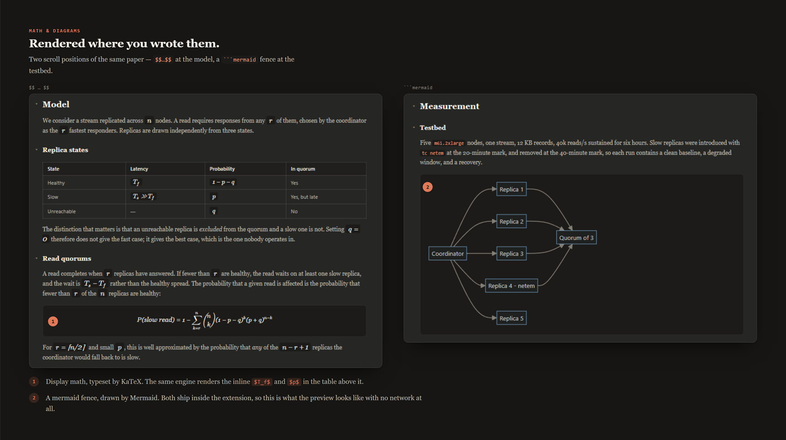
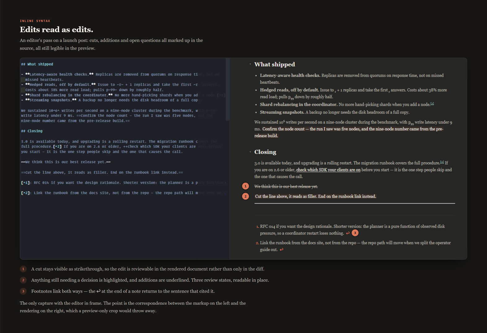

# graphite.md

A Markdown preview for people who read a lot of Markdown: collapsible
sections, a git-graph style outline, checklists, math, and diagrams — in a
dark, distraction-free theme.

**[Documentation](https://rog-stdioh.github.io/graphite-md/)** ·
**[Marketplace](https://marketplace.visualstudio.com/items?itemName=rog-stdioh.graphite-md)** ·
**[Issues](https://github.com/ROG-stdioh/graphite-md/issues)**



## Features

**Collapsible sections.** Every heading in your document collapses and
expands independently. Long specs and READMEs stop being one giant scroll.

**A git-graph outline.** The right-hand "On this page" pane shows your
document's structure as a connected graph — not a flat list — split into
three views:
- **Content** — your heading structure, nested exactly as it is in the doc
- **Tables** — every table in the document, jump straight to any of them
- **Diagrams** — every diagram, same idea

Only one view is open at a time. Click any node to soft-scroll to that part
of the document; the outline highlights where you are as you scroll.



**Checklists.** Write `- [ ]` and `- [x]` as usual. In the preview they
render as real, clickable checkboxes — checking one off edits your markdown
file directly, so your task list and your document never drift apart.



**Math.** Inline (`$...$`) and block (`$$...$$`) math, rendered with KaTeX.

**Diagrams.** Fenced ` ```mermaid ` code blocks render as live diagrams.



**Callouts.** Blockquotes (`>`) get a distinct treatment so notes and
asides stand out from body text.

**Rich inline syntax.** Superscript (`^2^`), subscript (`~2~`), underline
(`++text++`), highlighting (`==text==`), strikethrough (`~~text~~`), and
footnotes (`[^1]`) all render natively.



**Links that go where you meant them to.** A relative link opens the file it
points at, resolved against the document you're previewing — the same way VS
Code's own Markdown preview resolves it. Absolute URLs open in your browser.
And a bare filename stays a filename: `README.md` in a sentence is not turned
into a link to `http://README.md`, which matters because plenty of country
domains (`.md`, `.sh`, `.rs`, `.pl`, `.so`, `.cc`) are also file extensions.

**Syntax highlighting.** Fenced code blocks are highlighted with
highlight.js, tinted to match the graphite theme.

**Tunable reading width.** Set it once in `settings.json`:

```json
"graphiteMd.contentWidth": 60
```

## Usage

1. Open a `.md` file.
2. Run **graphite.md: Open Preview to the Side** from the Command Palette,
   or press `Ctrl+K V` (`Cmd+K V` on macOS).
3. The preview updates live as you type.

## Settings

| Setting | Type | Default | Description |
|---|---|---|---|
| `graphiteMd.contentWidth` | number (40–100) | `60` | Width of the reading column, as a percentage of the available preview pane width. |
| `graphiteMd.remoteImages` | boolean | `false` | Load images from the network. Off by default — images stored beside the document always work, and turning this on lets any document you preview make requests to servers its author picked. |

## Requirements

VS Code 1.134.0 or later. No other setup — everything the preview needs
(KaTeX, Mermaid) ships bundled with the extension.

## Known limitations

- Images from the network (`https://…`) don't load unless you turn on
  `graphiteMd.remoteImages`. That default is deliberate: previewing a file
  shouldn't quietly tell a stranger's server that you opened it. Images stored
  beside the document are unaffected by the setting.
- An image referenced by an absolute path — `C:\pics\x.png`, or a `file://`
  URL — isn't loaded. The preview only resolves paths written relative to the
  document, and leaves anything absolute alone.
- An image that lives *outside* the folder you have open — `../images/x.png`
  from a file whose workspace doesn't contain `images/` — isn't loaded either,
  and it fails quietly, as an empty box. A preview may only read files inside
  the folder you opened and the document's own folder; VS Code's built-in
  Markdown preview has the same boundary and fails the same way. Open a folder
  containing both the document and its images, and the picture loads.
- Merged-cell tables (`rowspan` / `colspan`) aren't supported yet — a syntax
  for them is still being designed.
  ([#8](https://github.com/ROG-stdioh/graphite-md/issues/8))
- The preview doesn't yet follow the editor cursor, or the editor the preview.
  Re-rendering after an edit does preserve your scroll position, so you aren't
  thrown back to the top.
- After an extension update, the preview can keep running the previous
  version's bundle until the panel is reopened. Close and reopen the preview
  if it looks stale; the durable fix is content-hash busting.
  ([#6](https://github.com/ROG-stdioh/graphite-md/issues/6))
- The outline panel is a fixed width and can't be collapsed yet.
  ([#3](https://github.com/ROG-stdioh/graphite-md/issues/3))

## Contributing

See `DEVELOPMENT.md` for build instructions and an overview of how the
extension is put together.

## License

MIT
