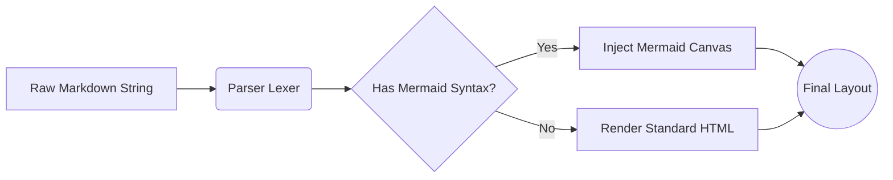
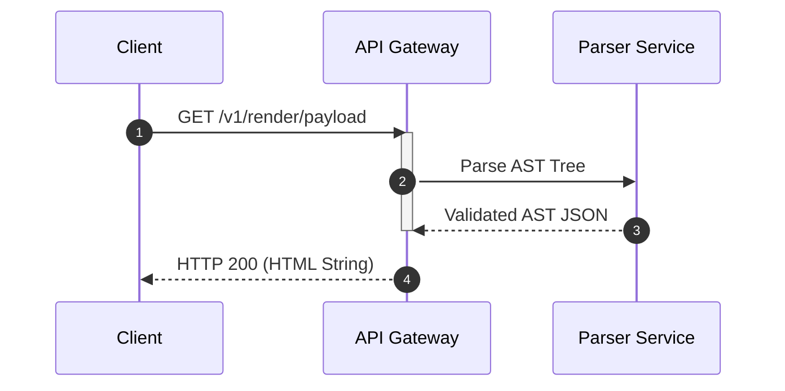

# graphite.md — Kitchen Sink

Everything the preview can render, in one file. Open this in the Extension
Development Host (`npm run build`, then F5) to eyeball the whole feature set at
once, or point the check scripts at it:

```
node scripts/render-check.js
node scripts/graph-check.js
```

<!-- Raw HTML renders, so this comment reaches the preview as a real comment and
     the browser hides it — the same thing that happens to it on GitHub. It
     doubles as a regression check: if comments are ever escaped back into
     visible text, the check scripts will see the angle brackets and fail. Its
     line breaks are load-bearing too. The renderer reports the source line of
     every checkbox it emits, and those numbers are positions in this file, so
     anything that shortens the source shifts them onto the wrong lines. -->

## H2: Section Heading

### H3: Sub-section Heading

#### H4: Sub-sub-section Heading

##### H5: Deep Heading

###### H6: Deepest Heading

Six levels, each nested under the one above. The outline's **Content** tab draws
exactly this shape as a graph — the chain above should come out as one limb four
levels deep, not a flat list.

## Text Formatting

Basic inline typography: **bold**, _italic_, **_bold italic_**, and
~~strikethrough~~.

The extended syntax: water is H~2~O and E = mc^2^. You can ++underline things++,
==mark them like a highlighter==, and combine them — ==**marked and bold**== or a
subscript inside a word like log~2~n.

Reference-style and bare links both work: [an inline link](https://example.com),
an autolink https://example.com, and `inline code` mid-sentence.

Unicode and symbols survive intact: — … → ✓ ✗ ⚠ ①②③ ∮ ∑ ∫ ° ± ≠ ≤ ≥.

## Quotes and Callouts

A plain blockquote gets the halftone callout treatment:

> Percentages resolve against the parent's content box, not the viewport.

Nested quotes stay inside their parent's box — the halftone field behind each
level must not bleed upward and wash out the text above it:

> This is the outer quote.
>
> > This is a nested sub-quote. Its text must stay fully legible, and the dot
> > gradient behind the outer quote must not clip it.
> >
> > > And a third level, for good measure.
>
> Back to the outer level.

Blockquotes can hold other elements. Headings inside a quote are **not** hoisted
into the document outline — the heading below belongs to this section, not to the
page structure:

> ### Markdown Inside Quotes
>
> This heading should not appear in the outline pane at all. If it does, the
> `t.level === 0` guard in `src/markdown.ts` has regressed.
>
> - A bullet inside a quote
> - Another one, with `code`
>
> > Deeper still.

## Lists

Unordered, nested three deep with mixed markers:

- First item
  - Nested item
    - Deeply nested item
- Second item
* Asterisk marker
+ Plus marker

Ordered, with a nested ordered list:

1. First step
2. Second step
   1. Sub-step one
   2. Sub-step two
3. Third step

A list item holding a fenced block and a quote:

- An item with a code block:

  ```js
  const nested = true;
  ```

- An item with a quote:

  > Quoted inside a list item.

### Checklists

- [x] A completed task
- [ ] An open task
- [ ] A task with **emphasis** and `code`

Checking a box in the preview edits the `[ ]` / `[x]` in the source file
directly. Note that a checklist *inside* a blockquote renders fine but its
checkboxes are inert — `toggleTaskAt()` in `src/extension.ts` matches the line
against `^(\s*[-*+]\s+)\[`, which a `> - [ ]` line does not satisfy:

> - [ ] A checkbox inside a quote (renders, but clicking does nothing)

## Code

A fenced JavaScript block, highlighted:

```javascript
import { createRoot } from 'react-dom/client';

// Main entry point
const rootElement = document.getElementById('root');
if (rootElement) {
  createRoot(rootElement).render(<App />);
}
```

A fenced block with no language — this must fall back to plain monospace with no
highlighting spans at all:

```text
$ npm install
[INFO] Fetching manifests...
[SUCCESS] Installed 14 packages in 2.34s
```

Python, to check a second grammar:

```python
def fib(n: int) -> int:
    """Return the n-th Fibonacci number."""
    a, b = 0, 1
    for _ in range(n):
        a, b = b, a + b
    return a

print(f"fib(10) = {fib(10)}")
```

An unknown language must degrade to plain text rather than throwing:

```notalanguage
this block names a language highlight.js has never heard of
  <angle brackets> & ampersands are escaped, not interpreted
```

Indented (four-space) code blocks are not fenced, so they get no highlighting:

    tell application "Foo"
        beep
    end tell

## Math

Inline math sits in a line of text: the Pythagorean theorem is $a^2 + b^2 = c^2$,
and the Gaussian density carries a $\sigma\sqrt{2\pi}$ term.

Display math stands alone, centred, on its own card:

$$\sum_{i=1}^{n} i = \frac{n(n+1)}{2}$$

$$f(x) = \int_{-\infty}^{\infty} e^{-x^2}\,dx$$

Bad LaTeX must render in red rather than taking down the render (texmath is
configured with `throwOnError: false`): $\frac{1}{$ is malformed.

## Links, Images and Footnotes

- An [external link](https://github.com).
- An [anchor link](#tables) that should soft-scroll to the Tables section.
- An  — this one must load.
- A  — this one must **not** load, which is the point: remote images are off unless you turn on `graphiteMd.remoteImages`. An empty box here is correct.

Footnotes collect into a numbered list at the foot of the preview. Clicking a
reference jumps to its note; the ↩︎ beside the note comes back to where you were
reading. Multiple references to the same note share one entry.

Here is a claim that needs a source,[^1] and a second one that needs a different
source.[^2] Here is the first note cited again[^1] to check that the back-reference
list grows rather than the note being duplicated,[^3] and here is a note with
**formatting** and `code` inside it.[^4]

[^1]: This is the text contents of the footnote rendered cleanly at the bottom of the page.
[^2]: A second note, to check numbering stays sequential.
[^3]: Third.
[^4]: A note containing **bold**, _italic_, `code`, and a [link](https://example.com).

## Tables

A table with every column alignment — left, centre, right, and default:

| ID | Component | Status | Render Time | Metrics |
| :-- | :-- | :-: | --: | :-- |
| 01 | Parser Engine | Operational | 12ms | `Stable` |
| 02 | Mermaid Renderer | Warning | 245ms | `High Latency` |
| 03 | LaTeX Compiler | Offline | -- | ❌ |

A narrower table, so the Tables tab has more than one entry to list:

| Setting | Default | Range |
| :-- | :-: | --: |
| `graphiteMd.contentWidth` | 60 | 40–100 |

Cells may contain inline syntax: **bold**, `code`, ==mark==, H~2~O, and $e^{i\pi}$.

## Diagrams

A flowchart, left to right:



A sequence diagram:



## Raw HTML

Everything in this section is HTML rather than Markdown. It renders exactly as
it is written, the way it does in VS Code's own preview and on GitHub, and the
elements below are styled by `media/preview.css` so none of them falls back to
a browser default drawn for a light page.

Inline: <mark>highlighted</mark>, <kbd>Ctrl</kbd>+<kbd>K</kbd>, <abbr title="Application Programming Interface">API</abbr>, <ins>inserted</ins>, H<sub>2</sub>O and mc<sup>2</sup>.

A definition list:

<dl>
  <dt>Rendering</dt>
  <dd>Turning the document's source into the HTML the preview shows.</dd>
  <dt>Outline</dt>
  <dd>The "On this page" pane — Content, Tables and Diagrams.</dd>
</dl>

A collapsed disclosure:

<details>
<summary>What happens to a &lt;script&gt; tag?</summary>
It reaches the page as a real element and never runs. The page's Content
Security Policy allows scripts only from a nonce it generated itself, so an
inline script and an <code>onclick=</code> attribute are both refused. See the
CSP in <code>src/webviewHtml.ts</code>.
</details>

A figure, and a rule:

<figure>
  
  <figcaption>A relative image written in raw HTML resolves like a Markdown one.</figcaption>
</figure>

---

A table written by hand. It renders with the same borders and padding as a
Markdown table. It does not yet appear in the Tables tab — the outline is fed by
ids the Markdown table renderer assigns, and a raw table never receives one.

<table>
  <thead>
    <tr><th>Stage</th><th>Cost</th></tr>
  </thead>
  <tbody>
    <tr><td>Markdown parse</td><td>5.5 ms</td></tr>
    <tr><td>Webview reload</td><td>99 ms</td></tr>
  </tbody>
</table>

### Raw HTML that must not do anything

These are here to be looked at, not used. Every one of them is inert in the
preview: the first three because the CSP refuses them, the last because the
panel is created with `enableForms: false`.

<p onclick="alert('inline handler')">A paragraph with an onclick handler.</p>

<iframe src="https://example.com" width="200" height="60"></iframe>

<script>document.body.textContent = 'a script that must never run';</script>

<form action="https://example.com/submit">
  <input type="text" value="a form that must never submit">
  <button type="submit">Submit</button>
</form>

## Edge Cases

Deliberately awkward input that has broken the renderer before:

- A paragraph with a hard line break at the end of this line  
  and the text continuing after it.
- A very long unbroken token: aaaaaaaaaaaaaaaaaaaaaaaaaaaaaaaaaaaaaaaaaaaaaaaaaaaaaaaaaaaaaaaaaaaaaaaaaaaaaaaaaaaaaaaaaaaaaaaaaaaaaaaaaaaaaaaa
- Characters that are HTML and are treated as such: <div> & </div> and <script>alert(1)</script> — the script element reaches the page and the page's policy refuses to run it. See "Raw HTML" above.
- Backslash escapes: \*not italic\*, \`not code\`, \_not italic\_
- A table cell containing a pipe: | is escaped as \| and must not split the row.
- A heading with trailing hashes that should be stripped: ### Trailing hashes ###

Empty and near-empty constructs:

- [ ]

A blockquote containing only whitespace:

>

The outline must survive all of the above, and every `</div>` in the rendered
HTML must still pair with an opening tag — a mismatch here is what previously
renested the whole right-hand pane to the bottom of the document.

# A Second Top-Level Heading

A second H1 is *not* swallowed as the document title — only the first one is
extracted. This one becomes a node in the outline's tree, and the headings below
it nest under it rather than standing as roots of their own.

## Nested Under the Second H1

Which means the Content graph should show this section as a child of "A Second
Top-Level Heading", one level in, with its own sibling relationship to the next
heading.

## A Sibling Under the Second H1

Two children of the same parent — these should share a vertical run in the graph
rather than each curving back to the trunk.
