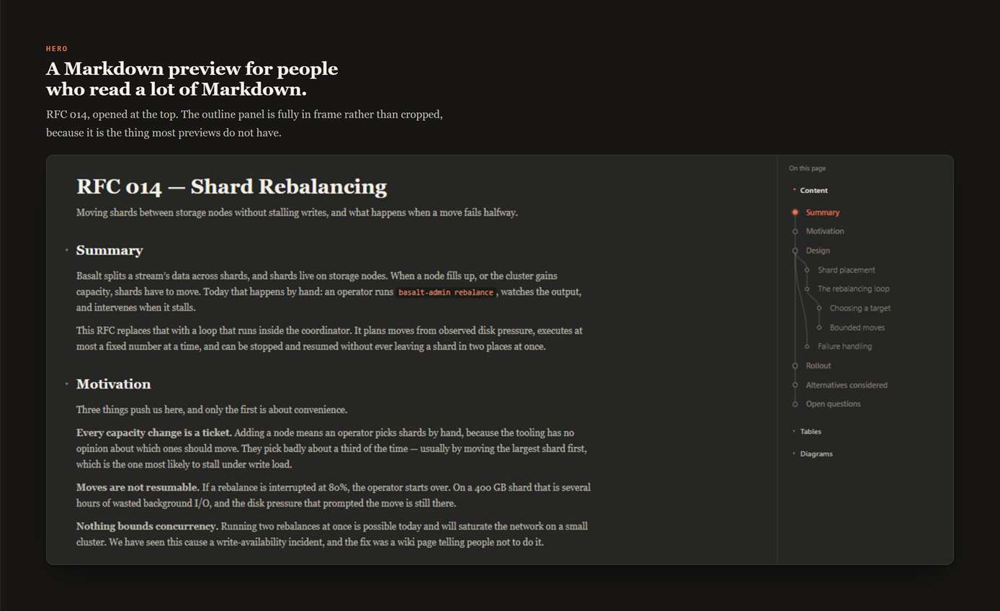
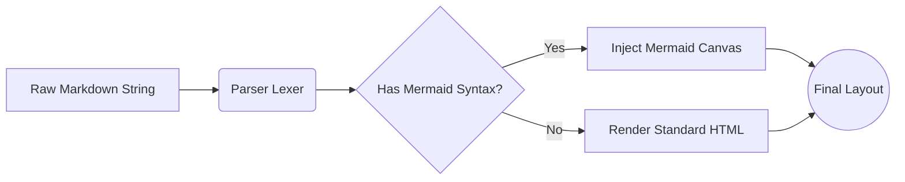
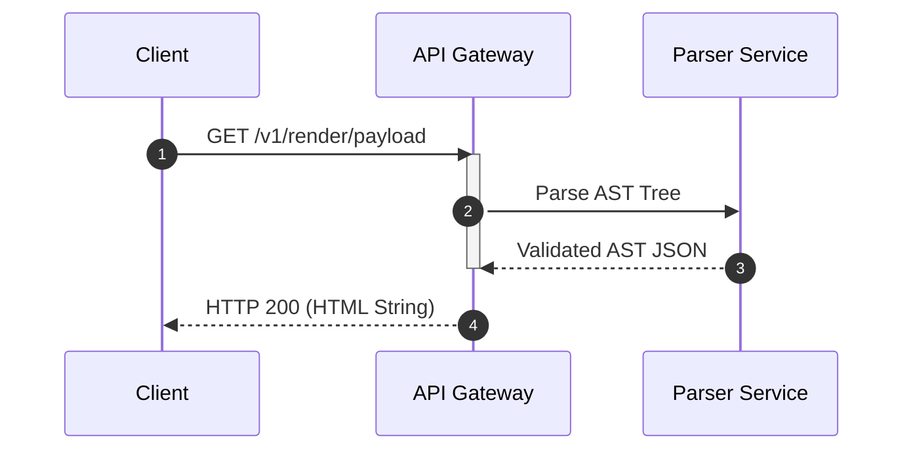
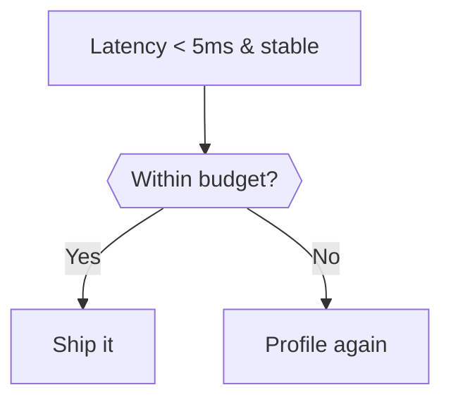

# graphite.md — Kitchen Sink

Everything the preview can render, in one file.

The three lines above the title are front matter, and they are drawn as the
table at the top of the page rather than as the rule and stray heading they used
to be. The title and the tags are the two rows of it. The paragraph above this
one is the subtitle — the renderer gives the first paragraph after the title
`class="doc-sub"`, which is the "a title, then one line" shape most documents
want — and this is ordinary body text.

Open the file in the Extension Development Host (`npm run build`, then F5) to
eyeball the whole feature set at once, or point the check scripts at it:

**Open the enclosing folder, not just this file.** A preview may load local
images from the workspace folders it was created with, or — when the document
belongs to none — from the document's own directory, and nothing else. That is
what VS Code's own Markdown preview does, and it matters here because this file
references `../images/`, one level *above* the folder it sits in. Opened as a
bare file there is no workspace folder to cover that, so those images are
refused and every one of them is a broken box. F5 opens an empty window, so
either open this folder in it first (File → Open Folder), or launch the host
with the folder directly:

```
code --extensionDevelopmentPath=<repo> <repo>
```

Changing folders does not retarget an already-open panel — its roots were fixed
when it was created — so reopen the preview afterwards.

```
node scripts/render-check.js
node scripts/graph-check.js
```

<!-- Raw HTML renders, so this comment reaches the preview as a real comment and
     the browser hides it — the same thing that happens to it on GitHub. It
     doubles as a regression check: if comments are ever escaped back into
     visible text, the check scripts will see the angle brackets and fail. Its
     line breaks are load-bearing too. The renderer reports the source line of
     every checkbox it emits, and those numbers are positions in this file, so
     anything that shortens the source shifts them onto the wrong lines. -->

## H2: Section Heading

### H3: Sub-section Heading

#### H4: Sub-sub-section Heading

##### H5: Deep Heading

###### H6: Deepest Heading

Six levels, each nested under the one above. The outline's **Content** tab draws
exactly this shape as a graph — the chain above should come out as one limb four
levels deep, not a flat list.

## Text Formatting

Basic inline typography: **bold**, _italic_, **_bold italic_**, and
~~strikethrough~~.

The extended syntax: water is H~2~O and E = mc^2^. You can ++underline things++,
==mark them like a highlighter==, and combine them — ==**marked and bold**== or a
subscript inside a word like log~2~n. Strikethrough nests as well:
~~**bold** and `code` inside a strikethrough~~.

The typographer is on by default (`graphiteMd.typographer` turns it off). The
line below is written with the characters a keyboard has and must render with
the ones type wants — curly quotes, an en dash, an em dash, an ellipsis, and the
symbols:

"Double quotes", 'single quotes', it's a contraction, an -- en dash, an --- em dash,
an ellipsis... and (c) (r) (tm) +- all in one line.

It is one long line rather than a wrapped one on purpose: a phrase split across
two lines of the source comes back with a newline inside it, so `an --- em dash`
broken after the dashes would no longer be the phrase this is checking.

HTML entities are resolved rather than shown, which is the one way a document
can name a character it cannot type: &copy; &amp; &#8212; &lt;not a tag&gt;.

Reference-style and bare links both work: [an inline link](https://example.com),
[the same target written as a reference][spec], a titled
[external link](https://example.com "The title rides on the link, whichever
spelling wrote it"), an autolink https://example.com, an address in angle
brackets <https://example.com>, and `inline code` mid-sentence.

[spec]: https://example.com "Reference-style links carry a title too"

Unicode and symbols survive intact: — … → ✓ ✗ ⚠ ①②③ ∮ ∑ ∫ ° ± ≠ ≤ ≥.

## Quotes and Callouts

A plain blockquote gets the halftone callout treatment:

> Percentages resolve against the parent's content box, not the viewport.

Nested quotes stay inside their parent's box — the halftone field behind each
level must not bleed upward and wash out the text above it:

> This is the outer quote.
>
> > This is a nested sub-quote. Its text must stay fully legible, and the dot
> > gradient behind the outer quote must not clip it.
> >
> > > And a third level, for good measure.
>
> Back to the outer level.

Blockquotes can hold other elements. Headings inside a quote are **not** hoisted
into the document outline — the heading below belongs to this section, not to the
page structure:

> ### Markdown Inside Quotes
>
> This heading should not appear in the outline pane at all. If it does, the
> `t.level === 0` guard in `src/markdown.ts` has regressed.
>
> - A bullet inside a quote
> - Another one, with `code`
>
> > Deeper still.

## Lists

Unordered, nested three deep with mixed markers:

- First item
  - Nested item
    - Deeply nested item
- Second item
* Asterisk marker
+ Plus marker

Ordered, with a nested ordered list:

1. First step
2. Second step
   1. Sub-step one
   2. Sub-step two
3. Third step

A list item holding a fenced block and a quote:

- An item with a code block:

  ```js
  const nested = true;
  ```

- An item with a quote:

  > Quoted inside a list item.

### Checklists

- [x] A completed task
- [ ] An open task
- [ ] A task with **emphasis** and `code`

Checking a box in the preview edits the `[ ]` / `[x]` in the source file
directly. Note that a checklist *inside* a blockquote renders fine but its
checkboxes are inert — `toggleTaskAt()` in `src/extension.ts` matches the line
against `^(\s*[-*+]\s+)\[`, which a `> - [ ]` line does not satisfy:

> - [ ] A checkbox inside a quote (renders, but clicking does nothing)

## Code

A fenced JavaScript block, highlighted:

```javascript
import { createRoot } from 'react-dom/client';

// Main entry point
const rootElement = document.getElementById('root');
if (rootElement) {
  createRoot(rootElement).render(<App />);
}
```

A fenced block with no language — this must fall back to plain monospace with no
highlighting spans at all:

```text
$ npm install
[INFO] Fetching manifests...
[SUCCESS] Installed 14 packages in 2.34s
```

Python, to check a second grammar:

```python
def fib(n: int) -> int:
    """Return the n-th Fibonacci number."""
    a, b = 0, 1
    for _ in range(n):
        a, b = b, a + b
    return a

print(f"fib(10) = {fib(10)}")
```

An unknown language must degrade to plain text rather than throwing:

```notalanguage
this block names a language highlight.js has never heard of
  <angle brackets> & ampersands are escaped, not interpreted
```

Indented (four-space) code blocks are not fenced, so they get no highlighting:

    tell application "Foo"
        beep
    end tell

## Math

Inline math sits in a line of text: the Pythagorean theorem is $a^2 + b^2 = c^2$,
and the Gaussian density carries a $\sigma\sqrt{2\pi}$ term.

Display math stands alone, centred, on its own card:

$$\sum_{i=1}^{n} i = \frac{n(n+1)}{2}$$

$$f(x) = \int_{-\infty}^{\infty} e^{-x^2}\,dx$$

`$…$` is inline and `$$…$$` is display; LaTeX's own `\(…\)` and `\[…\]` are not
delimiters here, so this line keeps its parentheses as text:

Inline \(x^2\) and display \[y^2\], but $z^2$ is maths.

A price is not a formula opener. Two dollars in a row is the case the pairing
rule exists for, and an earlier renderer paired the wrong two: in the line below
it opened a formula at `$5` and closed it at the `$` that opens `$x^2$`, so the
sentence became a red error box and the real formula never rendered at all.

It costs $5, and the other one costs $10, unlike $x + y$ which is maths. An
escaped dollar is a dollar and nothing more: \$5 and \$10, while $x$ is maths.

A `$$` formula that starts a line does not have to own the whole line. Anything
written after the closing `$$` has to survive, and so does the text between two
formulas on one line:

$$x^2$$ is the area, and $$y^2$$ is the other one — both on one line.

A `$$` formula alone on its line is a block instead, and a block spans the whole
column rather than sitting in a paragraph:

$$a^2 + b^2 = c^2$$

And a `$$` formula written *inside* a sentence stays in its sentence — the words
on both sides, in the one paragraph the sentence was written as:

The area $$x^2$$ is large.

Display math may run over several lines, and may sit inside a quote or a list
item, where it still spans the column it was given rather than escaping its
container:

$$
\int_0^1 x\,dx = \frac{1}{2}
$$

> $$
> \sum_{i=1}^{n} i
> $$
>
> A display formula inside a quote.

- A list item holding a display formula:

  $$
  e^{i\pi} + 1 = 0
  $$

Bad LaTeX must render in red rather than taking down the render (texmath is
configured with `throwOnError: false`): $\frac{1}{$ is malformed.

## Links, Images and Footnotes

- An [external link](https://github.com).
- An [anchor link](#tables) that should soft-scroll to the Tables section.
- A bare address, someone@example.com, still linkifies — an email is not
  ambiguous about what it is.
- A bare word that only looks like a domain does **not** linkify. Fuzzy matching
  is off here on purpose: `.md`, `.sh`, `.rs`, `.so`, `.pl` and `.cc` are all
  country-code TLDs, so a document that merely mentioned README.md, setup.sh or
  main.rs rendered links to real websites owned by strangers. All of those, and
  www.example.com with them, must stay plain text on this page.
- An  — this one must load.
- A  — this one must **not** load, which is the point: remote images are off unless you turn on `graphiteMd.remoteImages`. An empty box here is correct.

Footnotes collect into a numbered list at the foot of the preview. Clicking a
reference jumps to its note; the ↩︎ beside the note comes back to where you were
reading. Multiple references to the same note share one entry.

Here is a claim that needs a source,[^1] and a second one that needs a different
source.[^2] Here is the first note cited again[^1] to check that the back-reference
list grows rather than the note being duplicated,[^3] and here is a note with
**formatting** and `code` inside it.[^4]

[^1]: This is the text contents of the footnote rendered cleanly at the bottom of the page.
[^2]: A second note, to check numbering stays sequential.
[^3]: Third.
[^4]: A note containing **bold**, _italic_, `code`, and a [link](https://example.com).

## Tables

A table with every column alignment — left, centre, right, and default:

| ID | Component | Status | Render Time | Metrics |
| :-- | :-- | :-: | --: | :-- |
| 01 | Parser Engine | Operational | 12ms | `Stable` |
| 02 | Mermaid Renderer | Warning | 245ms | `High Latency` |
| 03 | LaTeX Compiler | Offline | -- | ❌ |

A narrower table, so the Tables tab has more than one entry to list:

| Setting | Default | Range |
| :-- | :-: | --: |
| `graphiteMd.contentWidth` | 60 | 40–100 |

Cells may contain inline syntax: **bold**, `code`, ==mark==, H~2~O, and $e^{i\pi}$.

A cell may be empty too, and an empty cell is not a missing one — the row keeps
its shape and the borders still line up:

| Filled | Empty | Also empty |
| :-- | :-: | --: |
| a value |  |  |
|  | a value |  |

## Diagrams

A flowchart, left to right:


```mermaid
graph LR
    A[Raw Markdown String] --> B(Parser Lexer)
    B --> C{Has Mermaid Syntax?}
    C -- Yes --> D[Inject Mermaid Canvas]
    C -- No --> E[Render Standard HTML]
    D --> F((Final Layout))
    E --> F
```

A sequence diagram:


```mermaid
sequenceDiagram
    autonumber
    Client->>API Gateway: GET /v1/render/payload
    activate API Gateway
    API Gateway->>Parser Service: Parse AST Tree
    Parser Service-->>API Gateway: Validated AST JSON
    deactivate API Gateway
    API Gateway-->>Client: HTTP 200 (HTML String)
```

A third, because a diagram's source is escaped before it reaches the page: `<`,
`>` and `&` in a label have to arrive as `&lt;`, `&gt;` and `&amp;`, or the
browser reads them as markup and the diagram does not draw at all:


```mermaid
graph TD
    A["Latency < 5ms & stable"] --> B{{Within budget?}}
    B -- Yes --> C[Ship it]
    B -- No --> D[Profile again]
```

## Raw HTML

Everything in this section is HTML rather than Markdown. It renders exactly as
it is written, the way it does in VS Code's own preview and on GitHub, and the
elements below are styled by `media/preview.css` so none of them falls back to
a browser default drawn for a light page.

Inline: <mark>highlighted</mark>, <kbd>Ctrl</kbd>+<kbd>K</kbd>, <abbr title="Application Programming Interface">API</abbr>, <ins>inserted</ins>, H<sub>2</sub>O and mc<sup>2</sup>.

A definition list:

<dl>
  <dt>Rendering</dt>
  <dd>Turning the document's source into the HTML the preview shows.</dd>
  <dt>Outline</dt>
  <dd>The "On this page" pane — Content, Tables and Diagrams.</dd>
</dl>

A collapsed disclosure:

<details>
<summary>What happens to a &lt;script&gt; tag?</summary>
It reaches the page as a real element and never runs. The page's Content
Security Policy allows scripts only from a nonce it generated itself, so an
inline script and an <code>onclick=</code> attribute are both refused. See the
CSP in <code>src/webviewHtml.ts</code>.
</details>

A figure, and a rule:

<figure>
  
  <figcaption>A relative image written in raw HTML resolves like a Markdown one.</figcaption>
</figure>

Four elements carry a `src` the host resolves — ``, `<video>`, `<audio>`
and `<source>` — and the two below are here for the middle pair. The source is a
picture, so neither will play anything, and that is not the point: the point is
that a relative `src` written in raw HTML goes to the host's resolver by the
same route a Markdown image's does, whatever element is carrying it.

<video src="../images/overview.png" controls></video>

<audio src="../images/overview.png" controls></audio>

---

A table written by hand. It renders with the same borders and padding as a
Markdown table, and it takes its place in the Tables tab beside them: every
table is given an id after rendering, in document order, whichever syntax wrote
it.

<table>
  <thead>
    <tr><th>Stage</th><th>Cost</th></tr>
  </thead>
  <tbody>
    <tr><td>Markdown parse</td><td>5.5 ms</td></tr>
    <tr><td>Webview reload</td><td>99 ms</td></tr>
  </tbody>
</table>

### Raw HTML that must not do anything

These are here to be looked at, not used. Every one of them is inert in the
preview: the first three because the CSP refuses them, the last because the
panel is created with `enableForms: false`.

<p onclick="alert('inline handler')">A paragraph with an onclick handler.</p>

<iframe src="https://example.com" width="200" height="60"></iframe>

<script>document.body.textContent = 'a script that must never run';</script>

<form action="https://example.com/submit">
  <input type="text" value="a form that must never submit">
  <button type="submit">Submit</button>
</form>

## Mixed HTML and Markdown

The two syntaxes in one document, which is how a README is actually written.
Inline HTML is transparent — a tag in the middle of a sentence is just a tag,
and the Markdown around it is unaffected. Blocks are the surprising half, so
most of this section is about them.

Inline: a <mark>highlighted</mark> word, a <kbd>Ctrl</kbd> chord and an
<abbr title="Too Long; Did Not Read">TL;DR</abbr> all sit inside this sentence,
and **bold after a tag** still renders, as does `code` and a [link](https://example.com).

### A block is raw until a blank line ends it

Nothing inside this block is Markdown, because no blank line separates it from
the tag that opened it:

<div class="callout">
**not bold**, *not italic*, and the two lines below are not a list:
- one
- two
</div>

The same block, with a blank line after the opening tag and another before the
close, does render what is inside it. That is the form to reach for:

<div class="callout">

**Bold**, *italic*, and those same two lines, now a real list:

- one
- two

</div>

That class is the one a `>` blockquote produces, so a hand-written
`<div class="callout">` draws the same halftone card. The styling keys off the
class, not off which syntax wrote it.

### The same blank line is what keeps a heading out of the block

Two `####` headings follow, and only the second one reaches the outline. The
first has no blank line above it, so the `</div>` before it swallowed the line
into its raw block and it is text on the page rather than a section. Open the
outline pane beside this and count them.

<div class="callout">Raw block content, ending on this line.</div>
#### Swallowed: no blank line above, so this is text rather than a heading

#### Kept: one blank line above, so this is a real section

### Markdown inside a raw table cell is raw too

A `<table>` written by hand is raw throughout, cells included, so the asterisks
below are shown rather than applied:

<table>
  <thead>
    <tr><th>Written as</th><th>Shown as</th></tr>
  </thead>
  <tbody>
    <tr><td>**bold**</td><td>**bold** — the asterisks are literal</td></tr>
  </tbody>
</table>

A Markdown table beside it, for contrast. Its cells do render inline syntax.
Both are in the Tables tab, and they are listed in the order they appear here
rather than the order they were rendered:

| Written as | Shown as |
| :-- | :-- |
| `**bold**` | **bold** |

A table named by hand. Its `id` is the document's rather than one the renderer
invents, so the outline targets `#totals` — which is what keeps a link someone
wrote, like [the totals](#totals), pointing at this table:

<table id="totals">
  <thead>
    <tr><th>Named by</th><th>Outline target</th></tr>
  </thead>
  <tbody>
    <tr><td>this document</td><td><code>totals</code></td></tr>
  </tbody>
</table>

## Headings and Anchors

Every heading becomes a section in the outline and an anchor on the page. The id
is the heading's own text, lower-cased, with punctuation dropped and spaces
turned into hyphens. Letters and numbers of any script survive, so a heading
written in a non-Latin script still has an anchor a hand-written link can name —
[this one](#café-日本語-ünïcödé-naïve), for instance:

### Café ☕ 日本語 — Ünïcödé Naïve

A heading whose text is nothing but punctuation has no anchor of its own, so it
falls back to `section` rather than to an empty id that nothing can link to:

### !!!

Two headings with the same text are two elements, and one id shared between them
would send every link to the first. The second and the third get numbered
suffixes, and the outline lists all three:

### Repeated Heading

### Repeated Heading

### Repeated Heading

Inline syntax in a heading renders in the outline as it does in the body: the
outline's label is the heading's text, and the heading on the page carries the
markup.

### A heading with **bold** and `code` in it

A heading may close with hashes, which are decoration rather than text. They are
stripped from the label the outline shows and from the anchor it targets:

### Trailing hashes are stripped ###

A heading can also be written with an underline instead of a `#` — a *setext*
heading, which is the older spelling of the same thing. A line of dashes makes
it a level-2 heading, which in turn makes it a sibling of this section rather
than a child of it, and that is where the outline puts it.

Setext Underline Heading
------------------------

## Edge Cases

Deliberately awkward input that has broken the renderer before:

- A paragraph with a hard line break at the end of this line  
  and the text continuing after it. A backslash at the end of a line is the
  other spelling of the same break:\
  this text is on the next line of the same paragraph.
- A very long unbroken token: aaaaaaaaaaaaaaaaaaaaaaaaaaaaaaaaaaaaaaaaaaaaaaaaaaaaaaaaaaaaaaaaaaaaaaaaaaaaaaaaaaaaaaaaaaaaaaaaaaaaaaaaaaaaaaaa
- Characters that are HTML and are treated as such: <div> & </div> and <script>alert(1)</script> — the script element reaches the page and the page's policy refuses to run it. See "Raw HTML" above.
- Backslash escapes: \*not italic\*, \`not code\`, \_not italic\_
- A table cell containing a pipe: | is escaped as \| and must not split the row.
- Trailing hashes, which the renderer strips. That heading is in "Headings and
  Anchors" above rather than in this list, because a `###` written mid-line in a
  list item is only ever text.

Both spellings of a thematic break, `***` and `___`, must come out as the same
`<hr>` the `---` further up produced:

***

And the underscore spelling of the same break:

___

A list may start at a number other than one, and it keeps it. A list with blank
lines between its items is a *loose* list — each item's content is wrapped in a
paragraph, which is a different shape from the tight lists above:

3. Third
4. Fourth

- An item with a blank line after it

- And another, so this list is loose

An item can be empty, and an empty item is still an item:

-

The checkbox marker only counts when something follows it. `- [ ]` with a task
after it is a real checkbox; `- [ ]` with nothing after it is a list item whose
text is the brackets themselves:

- [ ] a real checkbox, unchecked
- [x] a real checkbox, checked
- [X] the capital spelling counts as checked too
- [ ]

A blockquote containing only whitespace:

>

The outline must survive all of the above, and every `</div>` in the rendered
HTML must still pair with an opening tag — a mismatch here is what previously
renested the whole right-hand pane to the bottom of the document.

# A Second Top-Level Heading

A second H1 is *not* swallowed as the document title — only the first one is
extracted. This one becomes a node in the outline's tree, and the headings below
it nest under it rather than standing as roots of their own.

## Nested Under the Second H1

Which means the Content graph should show this section as a child of "A Second
Top-Level Heading", one level in, with its own sibling relationship to the next
heading.

## A Sibling Under the Second H1

Two children of the same parent — these should share a vertical run in the graph
rather than each curving back to the trunk.
