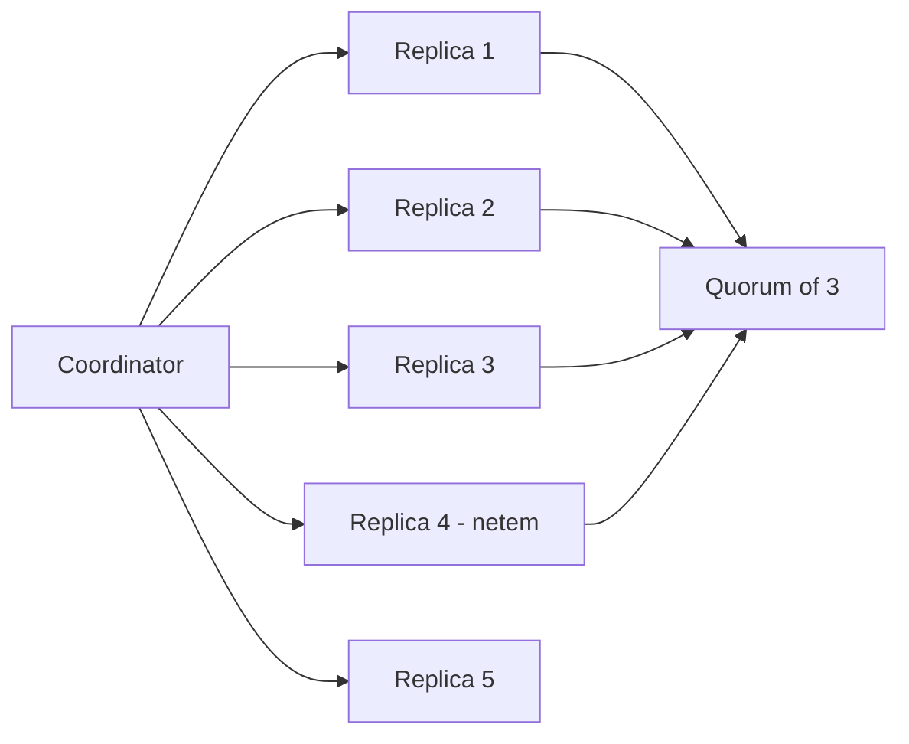

# Quorum Latency Under Partial Failure

Why a minority of slow replicas costs more than a minority of dead ones, and what that does to the read tail.

## Introduction

Replication protocols are usually reasoned about in terms of failure: a replica is up or it
is down, and quorums are sized so that any $r$ of $n$ responses is enough to make progress.
That model is tractable and mostly right, and it has a blind spot.

Dead replicas are cheap. A dead replica is removed from the quorum within one heartbeat, and
after that it costs nothing — the remaining replicas serve at full speed. Slow replicas are
expensive, because they are still in the quorum. Every read that touches one waits for it,
and the read path has no way to tell "slow" from "about to answer."

This note works out how much that costs, and reports measurements from a five-node Basalt
cluster that agree with the model to within about 9%.

## Model

We consider a stream replicated across $n$ nodes. A read requires responses from any $r$ of
them, chosen by the coordinator as the $r$ fastest responders. Replicas are drawn
independently from three states.

### Replica states

| State | Latency | Probability | In quorum |
| --- | --- | --- | --- |
| Healthy | $T_f$ | $1 - p - q$ | Yes |
| Slow | $T_s \gg T_f$ | $p$ | Yes, but late |
| Unreachable | — | $q$ | No |

The distinction that matters is that an unreachable replica is *excluded* from the quorum and
a slow one is not. Setting $q = 0$ therefore does not give the fast case; it gives the
best case, which is the one nobody operates in.

### Read quorums

A read completes when $r$ replicas have answered. If fewer than $r$ are healthy, the read
waits on at least one slow replica, and the wait is $T_s - T_f$ rather than the healthy
spread. The probability that a given read is affected is the probability that fewer than $r$
of the $n$ replicas are healthy:

$$
P(\text{slow read}) = 1 - \sum_{k=r}^{n} \binom{n}{k} (1-p-q)^{k} (p+q)^{n-k}
$$

For $r = \lceil n/2 \rceil$ and small $p$, this is well approximated by the probability that
*any* of the $n - r + 1$ replicas the coordinator would fall back to is slow.

## The tail is not the mean

The mean is dominated by the healthy case, which is why the effect is easy to miss on a
dashboard. The mean response time is roughly

$$
\mathbb{E}[T] \approx T_f + P(\text{slow read}) \cdot (T_s - T_f)
$$

and with $p = 0.02$ across five nodes at $r = 3$, $P(\text{slow read})$ is about 9%. That is
visible but not alarming. The $99^{th}$ percentile is a different quantity entirely, because
at that point the slow path is no longer an excursion — it is the common case.

### Why p99 diverges

The p~99~ of a read is set by the p~99~ of the *slowest replica in the quorum*, not by the
p~99~ of a single replica. Quorum latency is a maximum over $r$ samples, and maxima are
sensitive to exactly the tail that random sampling is supposed to average away. Adding
replicas to a quorum makes the tail worse, not better, once $p > 0$ — a result that is
obvious in hindsight and was not obvious to us when we sized the default.

## Measurement

### Testbed

Five `m6i.2xlarge` nodes, one stream, 12 KB records, 40k reads/s sustained for six hours. Slow
replicas were introduced with `tc netem` at the 20-minute mark, and removed at the 40-minute
mark, so each run contains a clean baseline, a degraded window, and a recovery.

### Results

| Condition | Mean | p95 | p99 |
| --- | --- | --- | --- |
| Baseline, $p = 0$ | 1.9 ms | 3.1 ms | 5.4 ms |
| One slow replica, $p = 0.2$ | 2.4 ms | 6.8 ms | 22.1 ms |
| Two slow, $p = 0.4$ | 3.6 ms | 18.4 ms | 41.7 ms |
| One dead, $q = 0.2$ | 1.9 ms | 3.2 ms | 5.6 ms |

The last row is the point of the whole exercise. Losing a replica outright is free; having one
answer slowly is not, and the two are indistinguishable from the coordinator's point of view
until the response arrives or the deadline fires.[^1]

## Discussion

The practical consequence is that replica health checks should test *latency*, not liveness.
A replica that answers in 400 ms is worse for the tail than one that does not answer at all,
because the dead one leaves the quorum and the slow one stays in it. Our current check is a
two-second deadline, which is far too generous — it admits exactly the replicas that do the
most damage.

A hedge would help: issue the read to $r + 1$ replicas and take the first $r$ responses,
accepting the extra load as the price of a bounded tail. We have not measured that yet, and
the load increase is not obviously affordable at 40k reads/s.[^2]

## Related work

Dean and Barroso's tail-at-scale paper makes the same maximum-over-samples argument for fan-out
at the service layer. Our contribution here is narrow: the same effect appears one layer down,
in the quorum itself, and the mitigation is the opposite of the usual one.

[^1]: The coordinator cannot distinguish slow from dead until either the response arrives or the deadline fires, so it must keep the slow replica in the quorum for the full deadline. This is the entire cost.

[^2]: A preliminary run at $r + 1$ hedging put read load up 38% and pulled p99 down to 11 ms. Promising, but it needs a longer run and a quieter cluster before we would ship it.
