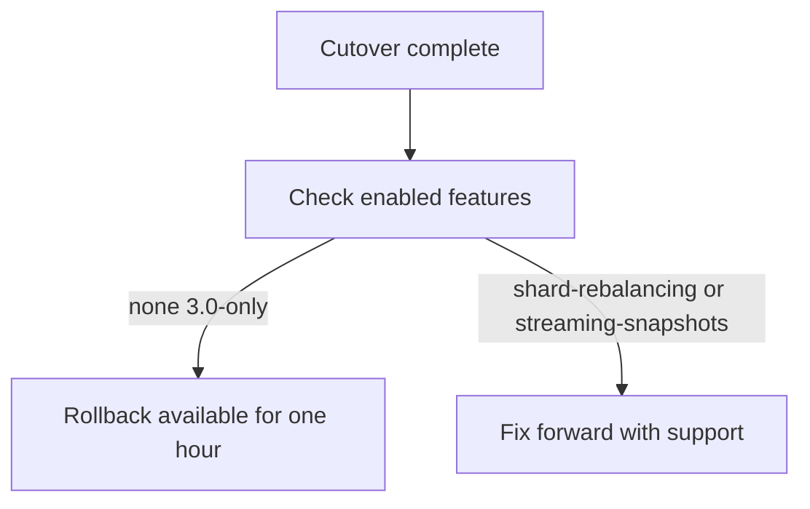

# v3 Migration Runbook

Moving a Basalt cluster from 2.x to 3.0 with no read downtime. Budget four hours; the cutover itself is under ten minutes.

## Before you start

Do not run this during a deploy freeze, and do not run it alone. The cutover step needs one
person watching the coordinator log and one watching client error rates, and they need to be
able to talk to each other without going through a ticket.

- [x] Change window approved, announced 72 hours ahead
- [x] On-call notified, and the migration is on the handover
- [x] Snapshot taken and **verified restorable** — a snapshot you have not restored is not a backup
- [ ] Rollback owner named, and they are not the person driving the cutover
- [ ] Client teams told which SDK version they need

> **Version skew is the thing that bites.** 2.x clients can read from a 3.0 cluster but cannot
> write to one. If any client is still on an SDK older than 2.7, the cutover will appear to
> succeed and writes will fail an hour later when the first one reconnects.

## Pre-flight

Run all of this against the live cluster. Nothing here is destructive.

```sh
basalt-admin cluster status --check-compat
basalt-admin shard list --unhealthy
basalt-admin snapshot verify --latest
```

- [x] `--check-compat` reports no blocking incompatibilities
- [x] No shards in `UNDER_REPLICATED` or `SPLITTING`
- [x] Snapshot verifies and its timestamp is under an hour old
- [x] Every client SDK reports 2.7 or newer
- [ ] Coordinator, all storage nodes and all gateways on the same 2.x patch release
- [ ] At least 25% free disk on every node — the migration rewrites the shard index and it is not small

<details>
<summary>What a clean <code>--check-compat</code> looks like</summary>

```text
compat: 3 blocking checks, 0 failed
  coordinators     2.8.4   ok
  storage nodes    2.8.4   ok   (12/12)
  gateways         2.8.4   ok
  client SDKs      2.7.1+  ok   (minimum 2.7.1)
```

Anything reading `warn` is the thing to chase now, not during the window. The one that has
bitten us is an SDK pinned by a transitive dependency: the application is on 2.8 and the
driver it pulls in is on 2.5.

</details>

## Cutover

This is the only step that touches production. Expect 6 to 9 minutes.

1. Drain the gateways: `basalt-admin gateway drain --wait`
2. Confirm zero in-flight writes with `basalt-admin writes inflight`
3. Upgrade the coordinators, one at a time, waiting for raft leadership to settle between each
4. Upgrade storage nodes in batches of 3, rolling
5. Upgrade gateways and un-drain

| Step | Expected | Pausable |
| :--- | ---: | :--- |
| Gateway drain | 1–2 min | yes |
| Coordinator upgrade | 2–3 min | yes, between nodes |
| Storage batches | 3–5 min | yes, between batches |
| Un-drain | under 1 min | no |

- [ ] Step 3 complete, leadership stable on a single coordinator for two minutes
- [ ] Step 4 batch 1 healthy before starting batch 2
- [ ] Writes flowing, verified with a real client rather than a smoke test

> **If the drain stalls**, it is almost always one gateway holding an idle keep-alive
> connection open. <kbd>Ctrl</kbd>+<kbd>C</kbd> stops the drain cleanly and leaves the
> cluster exactly where it was — nothing is committed until step 3.

## Verification

Give it fifteen minutes of real traffic before declaring success. The failure mode we have
seen most is a shard that reads correctly and rejects writes under compaction.

- [ ] Read p99 within 20% of the pre-migration baseline
- [ ] Write p99 within 20% of baseline
- [ ] No shards in `UNDER_REPLICATED` after fifteen minutes
- [ ] Compaction ran at least once on every node
- [ ] One full backup completed end to end

## Rollback

Rolling back is supported for one hour after the [cutover](#cutover), and only if no 3.0-only
features have been enabled. Check before you need it:

```sh
basalt-admin cluster features --list-enabled
```



If anything reads `shard-rebalancing` or `streaming-snapshots`, rollback is no longer
available and the forward path is to fix forward with support on the call.

- [ ] Feature list checked and recorded in the migration ticket
- [ ] Rollback rehearsed in staging within the last week

## After the migration

- [ ] Update the runbook with anything that surprised you — the next person reads this, not the ticket
- [ ] Remove the 2.x SDK from the client docs
- [ ] Close the migration ticket with the actual timings, not the planned ones
